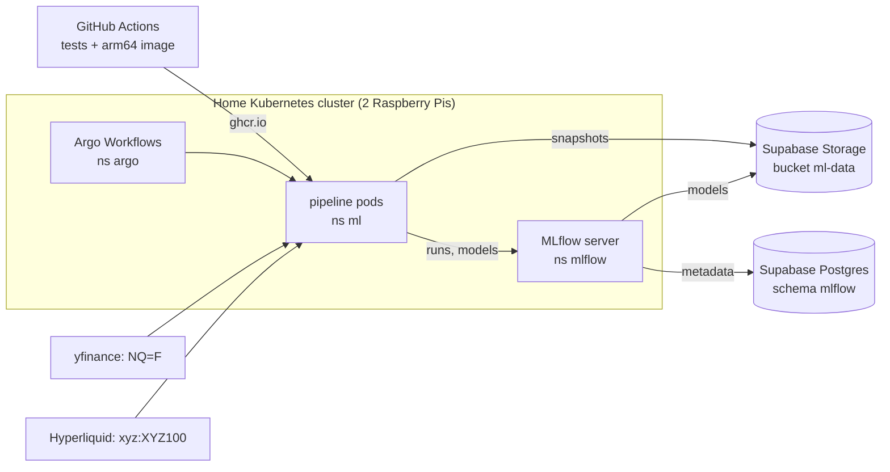
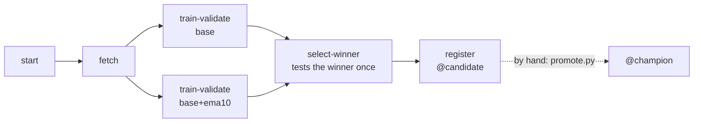

# ml-pipelines

Reproducible ML experiment pipelines for a home Kubernetes cluster (two Raspberry Pis).
The focus is the pipeline, not a clever model: fixed data snapshots, a purge between
train / validation / test, one test evaluation per experiment, and every run tracked in MLflow.

> Status: the Nasdaq experiment runs end to end on the cluster; a person promotes the result.
> Learning and portfolio project — the result below is "no edge", honestly measured.

## How it fits together



The cluster holds no volumes: data, models and run metadata live outside it, so any pod can be
replaced, upgraded or rolled back without losing state.



## Layout

| Path | What |
|---|---|
| `shared/mlkit/` | shared by every project: splits + purge, labels, AUC with block-bootstrap interval, MLflow conventions |
| `pipelines/nasdaq/` | first project: train on CME Nasdaq futures (`NQ=F`), validate and test on both NQ and the Hyperliquid perpetual `xyz:XYZ100` |
| `platform/` | Argo Workflows and MLflow, installed with Helm; see [platform/README.md](platform/README.md) |
| `docs/postmortems/` | what broke, why, and what changed because of it |

## Platform

| Component | Where | State |
|---|---|---|
| Argo Workflows v4.1.4 | namespace `argo`, runs workflows in `ml` | — |
| MLflow 3.16.0 | namespace `mlflow`, UI on port 30500 (home network only) | metadata in Supabase Postgres (schema `mlflow`) |
| Data and models | Supabase Storage bucket `ml-data`, S3 API | outside the cluster |

The cluster holds no volumes: a pod can be replaced, upgraded or rolled back (`helm rollback`) without
losing runs or models. Things learned installing MLflow 3 on a Raspberry Pi (a read-only root
filesystem, ~2 GB of background job workers, presigned downloads) are in the platform values file.

## The Nasdaq experiment

A snapshot is defined in `pipelines/nasdaq/datasets/<name>.yaml` and fetched once.

```
NQ      |──────── train ────────|p|── val ──|p|── test ──|
XYZ100                             |── val ──|  |── test ──|
```

1. **fetch** — candles for both sources, cleaned (unaligned, unfinished and zero-volume candles dropped);
   skipped when the snapshot already exists
2. **train + validate** — one run per feature set, same Random Forest, same seed; features are computed
   in-process from the raw snapshot (never stored) and are all relative, so price level does not matter
3. **select + test** — best validation AUC wins; only the winner sees the test period, once
4. **register** — the winner becomes a new version of `nasdaq-direction`, alias `@candidate`

Validation and test are scored only on hours both sources have, so NQ and XYZ100 are compared on
the same moments.

## First result (snapshot `2026-10`)

Train up to 2026-05-31, validation June–July, test August–September 2026. AUC with 95% interval
(block bootstrap), from the runs on the cluster:

| Feature set | val NQ | val XYZ100 | test NQ | test XYZ100 |
|---|---|---|---|---|
| `base+ema10` (winner) | 0.499 (0.431–0.556) | 0.508 (0.454–0.553) | 0.485 (0.427–0.533) | 0.507 (0.449–0.556) |
| `base` | 0.494 (0.424–0.551) | 0.499 (0.446–0.545) | — | — |

Every interval contains 0.5: **these features carry no detectable edge**, and adding the distance to
EMA(10) does not change that. Three workflow runs in a row gave identical numbers to six decimals.
(The first local run used a snapshot fetched two days earlier; its AUCs differ in the third decimal.)

## Run it locally

```bash
python -m venv .venv
.venv/Scripts/python -m pip install -e shared/mlkit -r pipelines/nasdaq/requirements.txt -r requirements-dev.txt
cd pipelines/nasdaq
../../.venv/Scripts/python run_local.py
../../.venv/Scripts/mlflow ui --backend-store-uri sqlite:///mlflow.db
```

## Run it on the cluster

A tag `nasdaq-v<version>` makes GitHub Actions run the tests and build the arm64 image
`ghcr.io/njwgroeneveld/ml-pipelines-nasdaq:<version>`. Then, on a machine with `kubectl` and
the [argo CLI](https://github.com/argoproj/argo-workflows/releases):

```bash
argo submit -n ml pipelines/nasdaq/image-check.yaml -p image_tag=0.3.0 --log   # once per image, on both nodes
kubectl apply -f pipelines/nasdaq/workflow-template.yaml
argo submit -n ml --from workflowtemplate/nasdaq-experiment -p image_tag=0.3.0
argo get -n ml @latest
```

A real run (`argo get`, image 0.3.0):

```
STEP                                    TEMPLATE    PODNAME                                 DURATION
 ✔ nasdaq-experiment-d29hp              experiment
 ├───✔ start(0)                         run         nasdaq-experiment-d29hp-run-967341948   32s
 ├───✔ fetch(0)                         run         nasdaq-experiment-d29hp-run-3576724307  31s
 ├─┬─✔ train-validate(0:base)(0)        run         nasdaq-experiment-d29hp-run-2984159147  2m
 │ └─✔ train-validate(1:base+ema10)(0)  run         nasdaq-experiment-d29hp-run-1067785917  2m
 ├───✔ select-winner(0)                 run         nasdaq-experiment-d29hp-run-1828125365  1m
 └───✔ register(0)                      run         nasdaq-experiment-d29hp-run-3296696493  32s
```

`fetch` finds the snapshot already in storage and skips; both feature sets train at the same time.

A failed step is retried twice with backoff, except a failed data check (exit code 2). A run takes
about five minutes on the Raspberry Pis. Deleting a training pod halfway through is survived: Argo
retries the step, and only finished MLflow runs can become the winner.

## Releasing a model

A release is moving an alias, never copying a file. Every run registers its winner as a new version
of `nasdaq-direction` and points `@candidate` at it. `@champion`, what a consumer would load, only
moves by hand:

```bash
cd pipelines/nasdaq
MLFLOW_TRACKING_URI=http://<node-ip>:30500 python promote.py              # @candidate becomes @champion
MLFLOW_TRACKING_URI=http://<node-ip>:30500 python promote.py --version 6  # roll back
```

`promote.py` prints the previous champion and the command to go back to it. Each version carries the
feature set, dataset, image and commit it came from:

| Version | Feature set | Image | Commit | Alias |
|---|---|---|---|---|
| 1 | `base+ema10` | local run | – | |
| 2 | `base+ema10` | trial pod | `a8abfbf` | |
| 3–6 | `base+ema10` | `0.2.0` | `413278c` | |
| 7 | `base+ema10` | `0.3.0` | `155ae07` | `@candidate`, `@champion` |

Versions 3–6 were built before the history of this repository was rewritten for publication, so
their commit is not in it; the code was the same. Version 7 was promoted, rolled back to 6 and
promoted again as a drill.

## Adding a feature

1. Write a function in `pipelines/nasdaq/features.py` and add it to `FEATURES`.
2. Add a feature set that uses it to `FEATURE_SETS`.
3. Run the experiment; compare the variants in MLflow.

The tests check that every feature is independent of price level and never looks ahead.

## Incidents and drills

- [Postmortem: MLflow 3 on a Raspberry Pi needed three fixes before it stayed up](docs/postmortems/2026-10-04-mlflow-on-a-raspberry-pi.md)
  (and a fourth, found when the UI was first opened in a browser).
- Drill: a training pod deleted halfway through a run. Argo retried the step; the killed attempt
  stayed `RUNNING` in MLflow, and only finished runs can win, so the result was unaffected.
- Three runs in a row on the same snapshot gave identical metrics to six decimals.

## Disclaimer

Learning and portfolio project. Not financial advice, not used for live trading.
